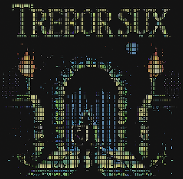

# Trebor Sux

This game plays homage to Wizardry, Dungeons and Dragons and other games 
where created characters crawl a dungeon, encounter monsters, gain skills, 
find treasure and destroy the main wizard.

In Wizardry I, a sign reads "P.S. TREBOR SUX". "Trebor" refers to one of the 
game developers, Robert Woodhead (first name backwards). I named this game 
Trebor Sux to honor my favorite childhood game.

## Progress

This started as a Python project, but transitioned to Go. This will never 
likely become a playable game, but it provides a proving ground for 
programming ideas.

At this time, the code only produces an initial splash screen.

